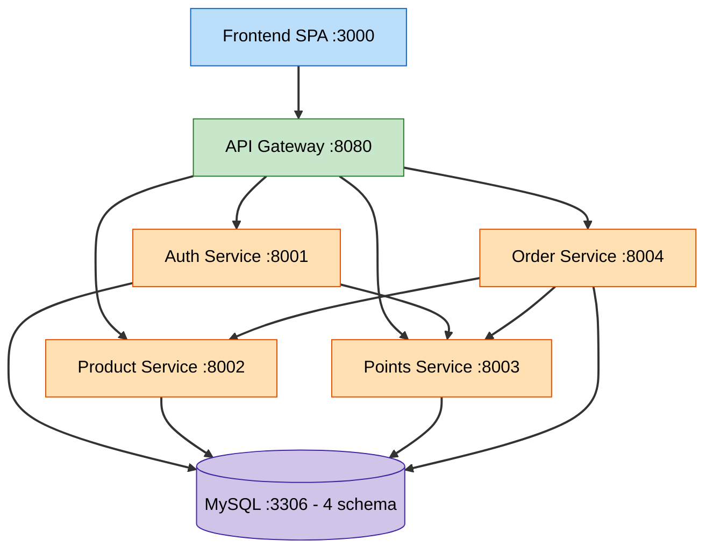

# 组件依赖与通信（Component Dependency & Communication）

> 阶段：INCEPTION - 应用设计
> 时间：2026-06-10T15:54:10+08:00

---

## 1. 服务依赖矩阵（调用方 → 被调方）

| 调用方 \ 被调方 | Auth | Product | Points | Order | Gateway |
|------------------|:----:|:-------:|:------:|:-----:|:-------:|
| **Frontend**     |  经网关  |  经网关  |  经网关  |  经网关  |  ✓  |
| **Gateway**      |  ✓(校验/路由) | ✓(路由) | ✓(路由) | ✓(路由) | -  |
| **Auth**         |  -   |    -    |  ✓(发积分) |   -   |   -   |
| **Product**      |  -   |    -    |   -    |   -   |   -   |
| **Points**       |  -   |    -    |   -    |   -   |   -   |
| **Order**        |  -   |  ✓(库存)  | ✓(扣减/退回) | - |   -   |

**说明**：依赖方向单向、无环。Order 依赖 Product 与 Points；Auth 依赖 Points（仅注册发放）。Product、Points 不主动依赖其他业务服务（被调用方），利于并行开发与独立演进。

---

## 2. 通信模式

| 链路 | 协议 | 同步/异步 | 备注 |
|------|------|-----------|------|
| Frontend → Gateway | HTTPS/REST | 同步 | 统一入口，附加 JWT |
| Gateway → 各服务 | HTTP/REST | 同步 | 注入用户身份头 |
| Auth → Points | HTTP/REST（内部） | 同步 | 注册发放入职奖励，失败重试/补偿 |
| Order → Points | HTTP/REST（内部） | 同步 | 扣减/退回，幂等(orderRef) |
| Order → Product | HTTP/REST（内部） | 同步 | 预占/释放/扣减，幂等(reservationId) |
| 各服务 → MySQL | JDBC | 同步 | 独立 schema |

- **全部同步 REST**（决策 Q1=A）。跨服务一致性由**编排式 Saga + 补偿 + 幂等**保证。
- 内部接口（`/internal/**`）仅内网可达，受 `InternalAuthFilter` 保护。

---

## 3. 部署/依赖关系图

### Mermaid



### 文本替代

```
Frontend(3000)
   |  (经网关)
   v
API Gateway(8080)  --路由+鉴权-->  Auth(8001), Product(8002), Points(8003), Order(8004)

服务间(内部 REST):
   Auth(8001)  --发积分-->  Points(8003)
   Order(8004) --库存预占/释放/扣减-->  Product(8002)
   Order(8004) --扣减/退回积分-->  Points(8003)

数据层: Auth/Product/Points/Order  --JDBC-->  MySQL(3306) 各自独立 schema
```

---

## 4. 关键数据流

### 4.1 兑换数据流（编排式 Saga）
```
用户 → 网关 → Order.createRedemption
  Order → Points: deduct(userId, amount, orderRef)        -> 扣减成功
  Order → Product: reserveStock(productId, qty, orderRef) -> 预占成功(reservationId)
  Order: 写入 Order(SUCCESS) + (实物)ShippingInfo / (虚拟)即时 COMPLETED
  失败任一步 → 逆序补偿: releaseStock / refund
```

### 4.2 注册数据流
```
用户 → 网关 → Auth.register → 写 User
  Auth → Points: grant(onboarding) -> 写 PointsBatch + Transaction(GRANT)
```

### 4.3 取消数据流
```
用户 → 网关 → Order.cancelOrder(发货前)
  Order → Points: refund -> Transaction(REFUND)
  Order → Product: releaseStock -> 释放预占
  Order: 状态 CANCELLED
```

---

## 5. 共享依赖（common 模块）
所有后端服务依赖 `common`（JWT 工具、统一响应/错误码、分页、角色枚举、异常处理、内部鉴权过滤器）。`common` 为编译期依赖，不引入运行期服务耦合。

---

## 6. 并行开发与构建顺序约束
- **无环依赖**，支持并行：Product 与 Points 无相互依赖，可并行开发。
- **构建顺序**（受运行期调用约束）：Unit7 基础设施 → Unit2 Auth → Unit6 网关 → (Unit3 Product ∥ Unit4 Points) → Unit5 Order → Unit1 前端。
- common 模块需最先就绪（被各服务依赖）。
