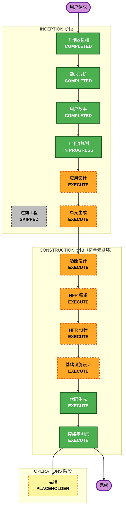

# 执行计划（Execution Plan）

> 阶段：INCEPTION - 工作流规划
> 时间：2026-06-10T15:43:34+08:00
> 输入：requirements.md（v1.1）、stories.md（US-01~28）、personas.md（P1~P3）、README.md

---

## 1. 详细分析摘要（Detailed Analysis Summary）

### 1.1 变更影响评估（Change Impact Assessment）
- **用户可见变更**：是 — 全新员工端 + 管理端 SPA
- **结构性变更**：是 — 全新微服务架构（6 服务 + 基础设施）
- **数据模型变更**：是 — 4 个独立 MySQL Schema（认证/商品/积分/兑换）
- **API 变更**：是 — 全新 REST API 与网关路由
- **NFR 影响**：是 — 性能、安全、并发、一致性、可访问性、i18n、面向 >5000 员工的容量

### 1.2 风险评估（Risk Assessment）
- **风险等级**：中-高（Medium-High）
- **主要风险点**：跨服务事务一致性（Saga 补偿）、库存并发（悲观锁防超兑）、积分 FIFO 过期、网关统一鉴权
- **回滚复杂度**：中（容器化部署，按服务独立）
- **测试复杂度**：复杂（单元 + 跨服务集成 + 并发/一致性测试）

### 1.3 工作单元（Units of Work，来自 README + 需求）
| 单元 | 名称 | 端口 | 性质 |
|------|------|------|------|
| Unit 7 | 基础设施（Docker/MySQL/网络） | 3306 | 基础，先行 |
| Unit 2 | 认证服务 | 8001 | 微服务 |
| Unit 6 | API 网关 | 8080 | 微服务（中间件） |
| Unit 3 | 商品服务 | 8002 | 微服务（可与 Unit4 并行） |
| Unit 4 | 积分服务 | 8003 | 微服务（可与 Unit3 并行） |
| Unit 5 | 兑换服务 | 8004 | 微服务（依赖 2/3/4） |
| Unit 1 | 前端 SPA | 3000 | 前端（依赖网关与各服务 API） |

**建议开发顺序**：Unit 7 → Unit 2 → Unit 6 → (Unit 3 ∥ Unit 4) → Unit 5 → Unit 1

---

## 2. 工作流可视化（Workflow Visualization）

### Mermaid 图



### 文本替代（Text Alternative）

```
INCEPTION 阶段：
- 工作区检测 .......... 已完成
- 逆向工程 ............ 已跳过（用户决定按全新开发处理）
- 需求分析 ............ 已完成
- 用户故事 ............ 已完成
- 工作流规划 .......... 进行中
- 应用设计 ............ 执行
- 单元生成 ............ 执行

CONSTRUCTION 阶段（对每个工作单元循环执行）：
- 功能设计 ............ 执行
- NFR 需求 ............ 执行
- NFR 设计 ............ 执行
- 基础设施设计 ........ 执行
- 代码生成 ............ 执行（始终）
- 构建与测试 .......... 执行（始终）

OPERATIONS 阶段：
- 运维 ................ 占位（未来扩展）
```

---

## 3. 待执行/跳过阶段（Phases to Execute）

### 🔵 INCEPTION 阶段
- [x] 工作区检测（COMPLETED）
- [x] 逆向工程（SKIPPED — 用户决定暂不考虑已有代码）
- [x] 需求分析（COMPLETED — requirements.md v1.1）
- [x] 用户故事（COMPLETED — 28 故事 / 3 画像）
- [x] 工作流规划（COMPLETED — 2026-06-10T15:47:10+08:00，用户批准）
- [x] 应用设计 — **EXECUTE**（COMPLETED 2026-06-10T15:58:36+08:00）
- [ ] 单元生成 — **EXECUTE**
  - **理由**：系统需拆解为 7 个工作单元并建立依赖与故事映射，支撑并行开发。

### 🟢 CONSTRUCTION 阶段（按单元循环）
- [ ] 功能设计 — **EXECUTE**
  - **理由**：每个服务有新数据模型/Schema 与复杂业务逻辑（积分 FIFO、库存预占、Saga）。
- [ ] NFR 需求 — **EXECUTE**
  - **理由**：存在性能、安全、并发、容量（>5000 员工）等明确 NFR。
- [ ] NFR 设计 — **EXECUTE**
  - **理由**：需将悲观锁、Saga、JWT、i18n、可访问性等 NFR 模式落到设计。
- [ ] 基础设施设计 — **EXECUTE**
  - **理由**：Docker Compose 编排、MySQL 多 Schema、网络、卷需明确（Unit 7）。
- [ ] 代码生成 — **EXECUTE（始终）**
  - **理由**：需实现各单元代码与测试。
- [ ] 构建与测试 — **EXECUTE（始终）**
  - **理由**：需构建、单元/集成/并发一致性测试与验证。

### 🟡 OPERATIONS 阶段
- [ ] 运维 — **PLACEHOLDER**（未来部署与监控扩展）

---

## 4. 跳过的阶段汇总（Skipped）
- 逆向工程：已跳过（用户决定暂不考虑已有 auth-service/gateway-service 代码）。

---

## 5. 成功标准（Success Criteria）
- **主要目标**：交付可运行的 AWSomeShop MVP（6 服务 + 前端 + 基础设施），员工与管理员核心闭环可用。
- **关键交付物**：各单元设计文档、代码与测试、docker-compose 一键启动、API 文档。
- **质量门槛**：
  - 满足 NFR-1 性能指标（页面 < 3s、API < 500ms、网关 P95 ≤ 50ms）
  - 并发不超兑、跨服务一致性（Saga 补偿）经测试验证
  - 单元测试 + 跨服务集成测试通过
  - WCAG 2.1 AA 可访问性、中英文双语

## 6. 预估规模（Estimated Scale）
- **执行阶段总数**：INCEPTION 剩余 2（应用设计、单元生成）+ CONSTRUCTION 每单元 4 设计阶段 + 代码生成，跨 7 个工作单元，最后统一构建与测试。
- **构建顺序**：Unit 7 → Unit 2 → Unit 6 → (Unit 3 ∥ Unit 4) → Unit 5 → Unit 1
